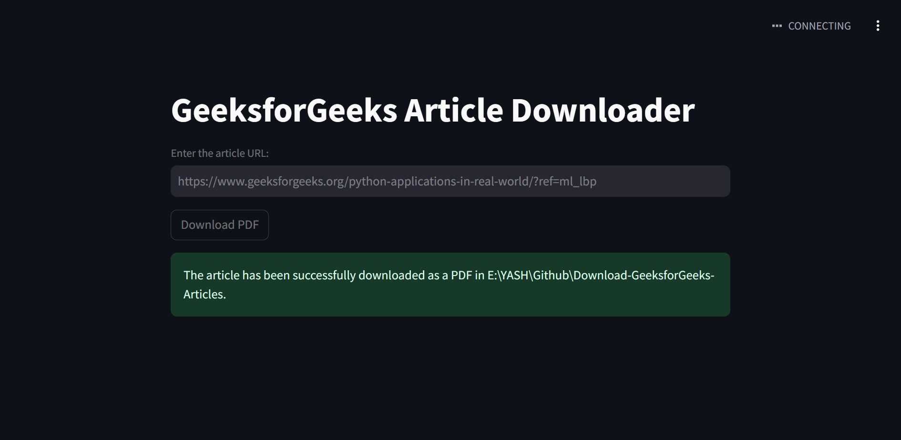

# GeeksforGeeks Article Downloader

This Streamlit app allows users to download articles from GeeksForGeeks as PDFs by providing the article URL.

## Live Demo

You can download the article by visiting the following link:
[Link](https://download-geeksforgeeks-articles.onrender.com/)

## About GeeksForGeeks

[GeeksForGeeks](https://www.geeksforgeeks.org/) is a platform that provides tutorials, articles, and resources for various programming languages, algorithms, data structures, and more. It is widely used by developers, students, and professionals to enhance their coding skills and knowledge.

## Prerequisites

- Python
- Streamlit
- Selenium
- Webdriver-manager

## Setup

1. Clone the repository:
   git clone https://github.com/yashchinchole/Download-GeeksforGeeks-Articles
2. Install dependencies:
   pip install -r requirements.txt
3. Run the app:
   streamlit run app.py
4. Enter the URL of the GeeksForGeeks article in the input field and click "Download PDF".

## Screenshots

## Note

The PDF will be downloaded to the default download location on your system.
